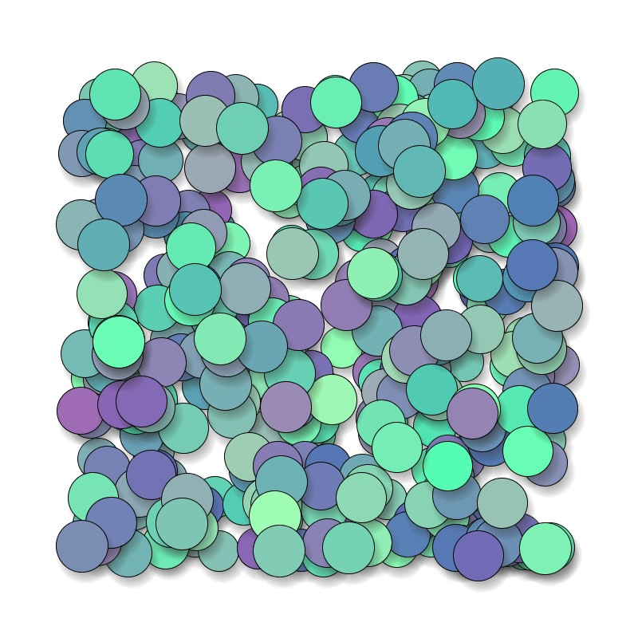
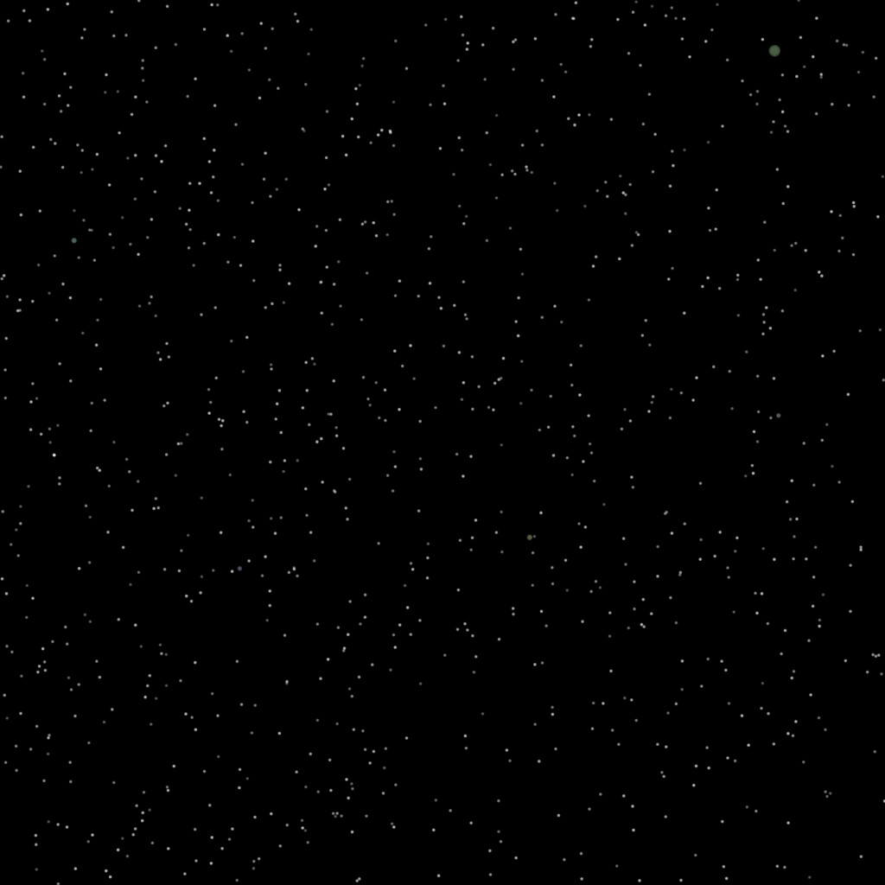
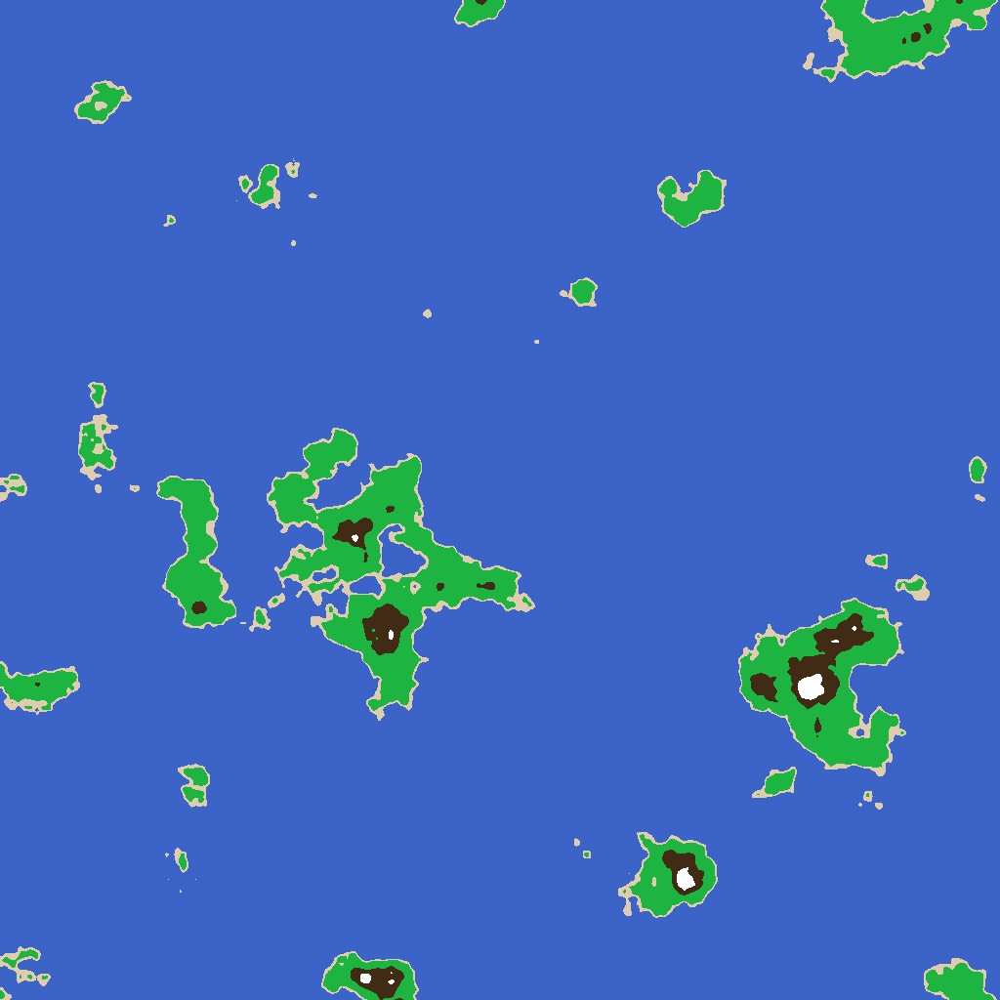

# Art Experiments with Processing for Python

## Requirements

* Make sure to have Processing installed and use the Python module to run the .pyde files

## Examples

### Circle Shadows

### Night Sky Generator

### Map Maker

### VJ_TOOLS_1

### VJ_TOOLS_2

### rotato_shapes

## Thanks

inspired by [erdavids](https://github.com/erdavids)
